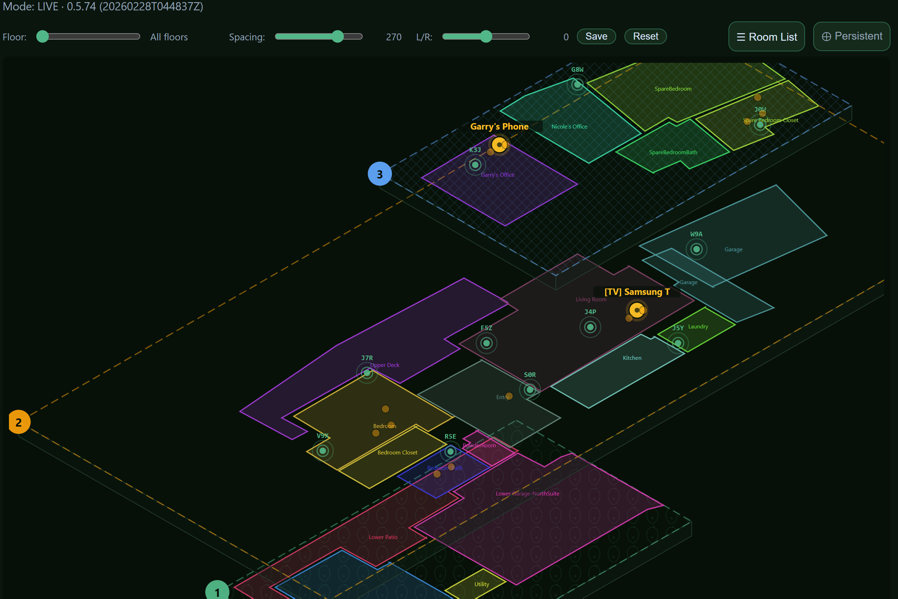
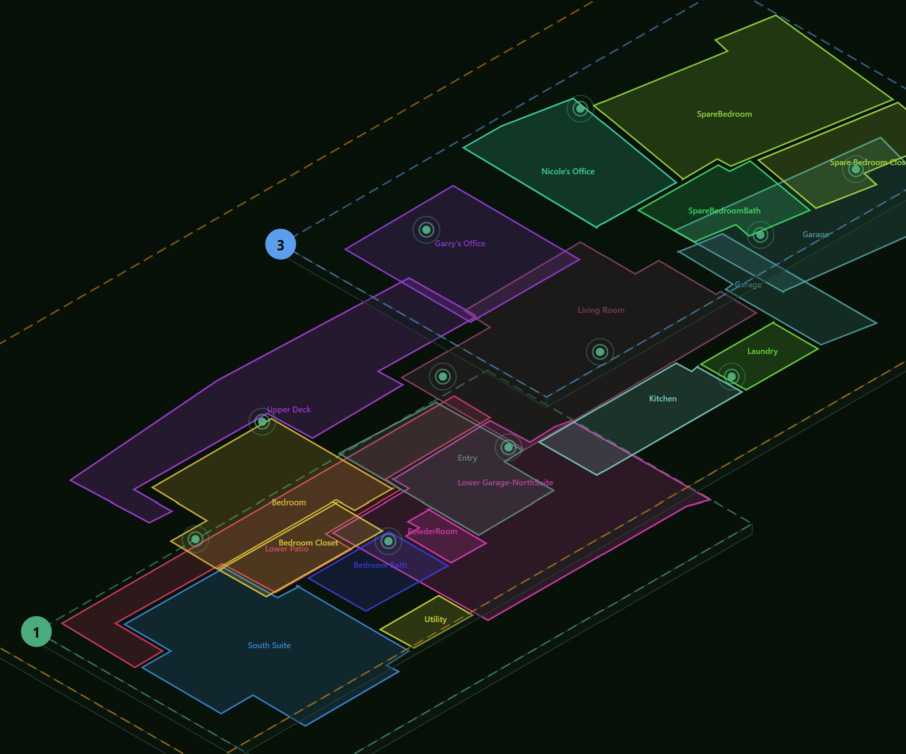
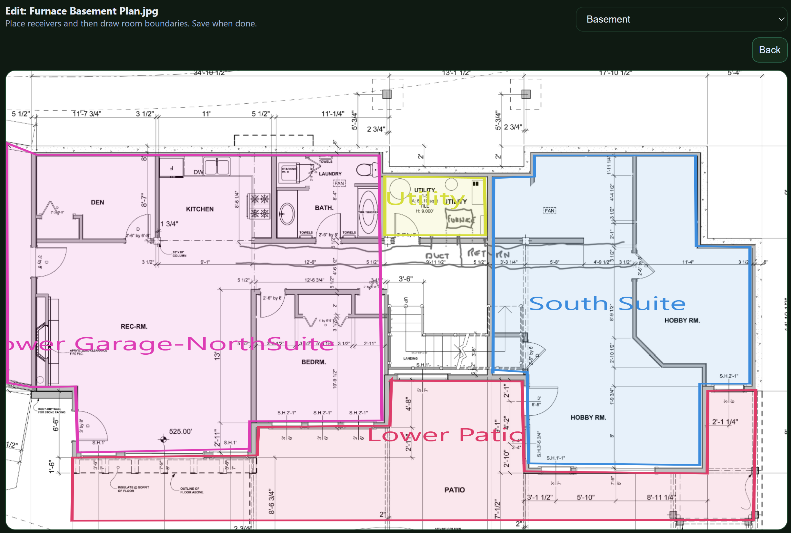
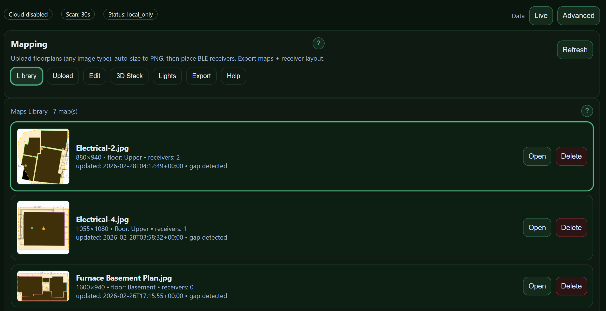
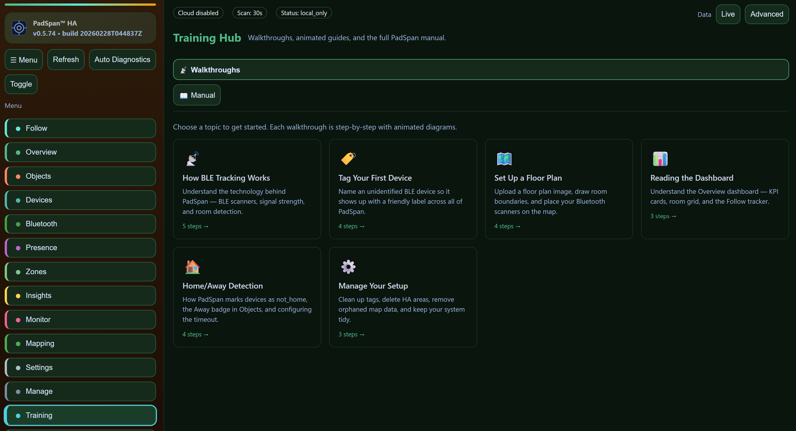

# PadSpan™ HA

### The most comprehensive BLE room-presence system for Home Assistant

PadSpan™ HA goes far beyond "home or away." It tells you **which room** every Bluetooth device is in — updated every 5 seconds — with interactive floor plans, 3D multi-floor visualizations, a full calibration system, and 21 dedicated views. No other Home Assistant BLE integration comes close.

---

## Why PadSpan?

Most BLE presence integrations give you a config flow and a sensor. PadSpan gives you a **complete tracking workstation** — floor plan editor, room boundary polygons, 3D isometric maps, walk-around calibration, follow mode with email alerts, a training hub, and a full sample/demo mode so you can explore every feature before plugging in hardware.

It works with your existing BLE scanners (ESPresense, Bermuda proxies, or any HA Bluetooth proxy). No custom firmware. No cloud dependency. Everything runs locally.

---

## Screenshots

| 3D Multi-Floor Tracking | Floor Plan Editor |
|:-:|:-:|
|  |  |

| Maps Library | Training Hub |
|:-:|:-:|
|  |  |

---

## Feature Highlights

### Presence Tracking
- Room-level BLE device tracking (5-second refresh)
- **Follow mode** — animated room map + movement timeline for any tracked device
- Multi-device simultaneous tracking with per-device email alerts
- Kalman-filtered RSSI smoothing (replaces simple moving averages)
- Home/away detection with HA binary sensor entities
- Private BLE address resolution (iBeacon UUID + IRK support)

### Floor Plans & Maps
- Upload architectural floor plans (PNG/JPG) with auto-scaling
- Draw room boundary polygons directly over blueprints
- Multi-floor **3D isometric visualization** with live object positions
- Drag-and-place scanner markers with 3-digit radio IDs
- Auto-detect stale or missing radios on your map

### Calibration
- Walk-around fingerprint collection with a **standalone phone-friendly panel**
- k-NN fingerprint matching + OLS path-loss model fitting per scanner
- Coverage heatmap with guided "walk here next" target suggestions
- Leave-one-out cross-validation for model quality scoring
- 3D isometric tune view with draggable receiver markers

### Scanner Management
- Auto-discover BLE scanners from Home Assistant integrations
- Per-scanner signal quality metrics and coverage analysis
- WiFi SSID, IP address, and connection type display
- Assign scanners to floors and rooms on the map

### Alerts & Automation
- Email alerts on room change (per device, 60-second rate limit)
- HA entities: **area sensors**, **distance sensors**, **device trackers**, **binary sensors**
- Full WebSocket API for custom dashboards and automation

### UI & Experience
- **21 dedicated views** with Basic and Advanced modes
- Dark forest-green theme designed for always-on displays
- Built-in **Training Hub** with guided walkthroughs
- **Sample mode** — fully functional demo with synthetic data, no hardware needed
- **11 languages**: English, Spanish, French, German, Italian, Portuguese, Dutch, Chinese, Japanese, Korean, Russian
- Standalone calibration panel optimized for phone use during walk-around collection

---

## How It Compares

| Feature | PadSpan HA | Bermuda | Room Assistant | ESPresense Companion |
|:--------|:----------:|:-------:|:--------------:|:--------------------:|
| Room-level tracking | ✅ | ✅ | ✅ | ✅ |
| Visual floor plans | ✅ | — | — | — |
| 3D multi-floor maps | ✅ | — | — | — |
| Room boundary editor | ✅ | — | — | — |
| Fingerprint calibration | ✅ | — | — | — |
| Training hub | ✅ | — | — | — |
| Follow mode + alerts | ✅ | — | — | — |
| Sample/demo mode | ✅ | — | — | — |
| Multi-language (11) | ✅ | — | — | — |
| Dedicated UI views | 21 | Config flow | MQTT config | Config flow |
| HA sensor entities | ✅ | ✅ | ✅ | ✅ |
| Distance estimation | ✅ | ✅ | — | ✅ |
| Kalman RSSI filtering | ✅ | — | — | — |

---

## Installation

### Via HACS (recommended)

1. Open HACS in your Home Assistant instance
2. Add this repository as a **custom repository** (Integration type)
3. Search for and install **PadSpan HA**
4. **Restart Home Assistant completely** (Settings → System → Restart)
5. Add the integration: Settings → Devices & Services → Add Integration → PadSpan HA

### Manual

1. Download the [latest release](https://github.com/gbroeckling/padspanHA/releases/latest)
2. Extract `custom_components/padspan_ha/` into your HA `custom_components/` directory
3. Restart Home Assistant
4. Add the integration: Settings → Devices & Services → Add Integration → PadSpan HA

---

## Requirements

- Home Assistant **2024.1** or newer
- At least one BLE scanner (ESPresense, Bermuda proxy, or HA Bluetooth proxy)
- HACS (recommended for easy installation and updates)

---

## Quick Start

1. Install via HACS and restart HA
2. Add the PadSpan HA integration
3. Open the **PadSpan HA** panel in the sidebar
4. Try **Sample mode** to explore every feature with demo data
5. Switch to **Live mode** when ready — your BLE scanners are auto-discovered
6. Upload a floor plan, draw room boundaries, and place your scanners
7. Start tracking

---

## License

Copyright (C) 2026 Garry Broeckling. Licensed under the [GNU General Public License v3.0](LICENSE).

PadSpan is a trademark of Garry Broeckling.
