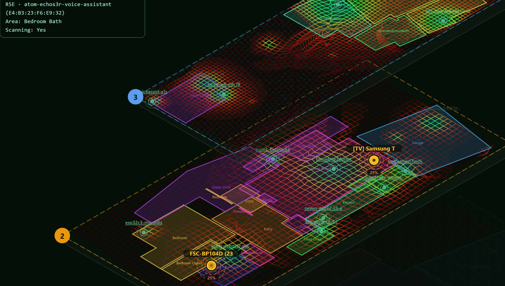
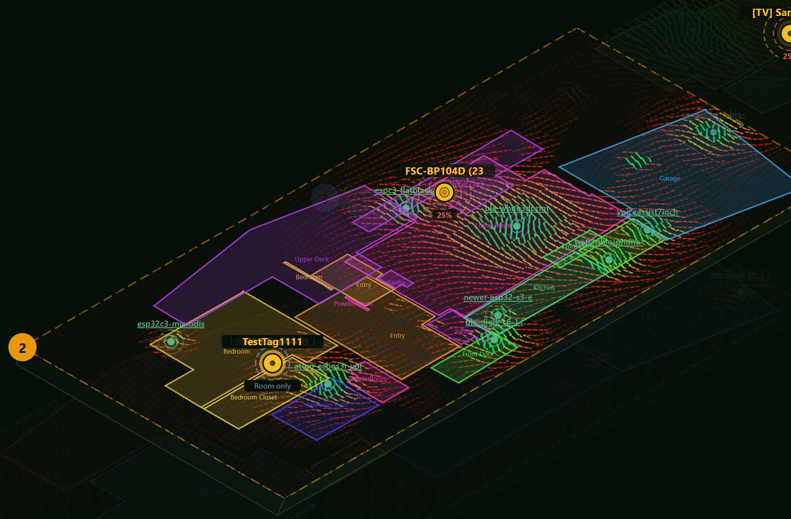
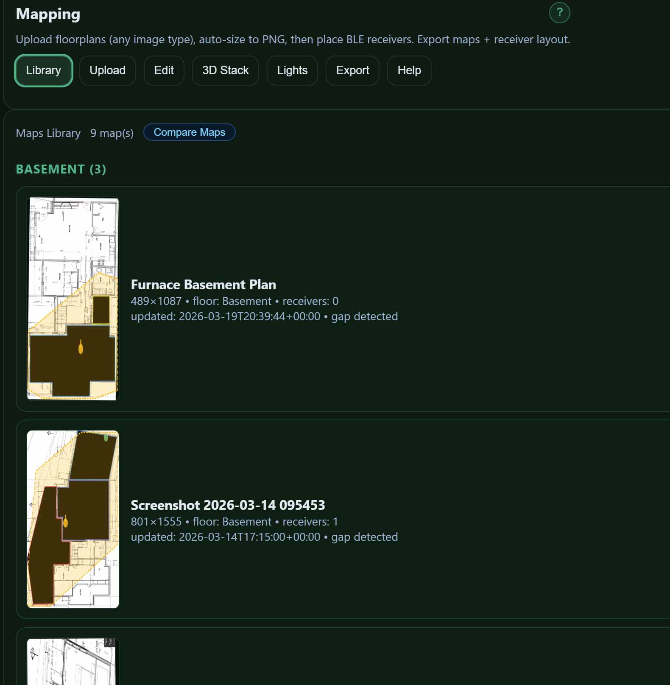
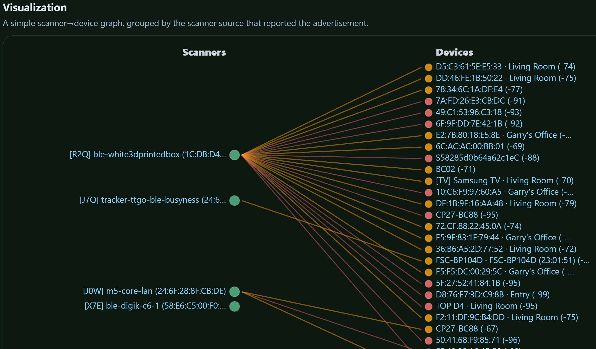
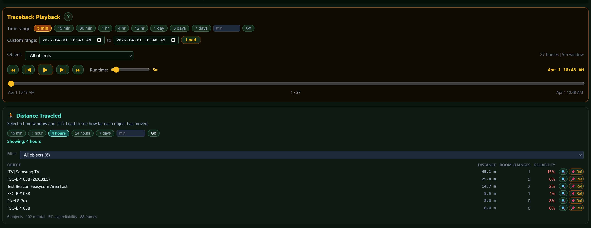
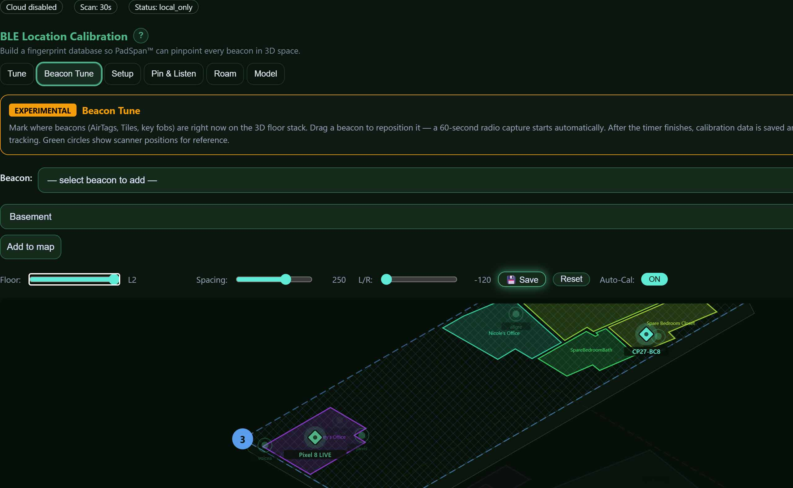
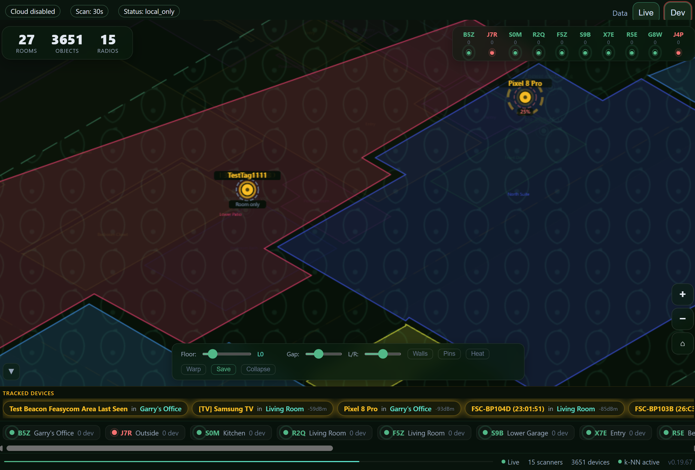
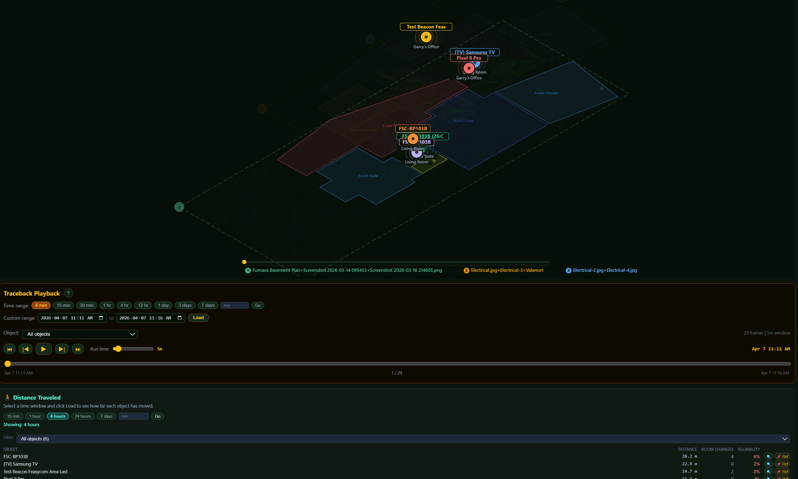
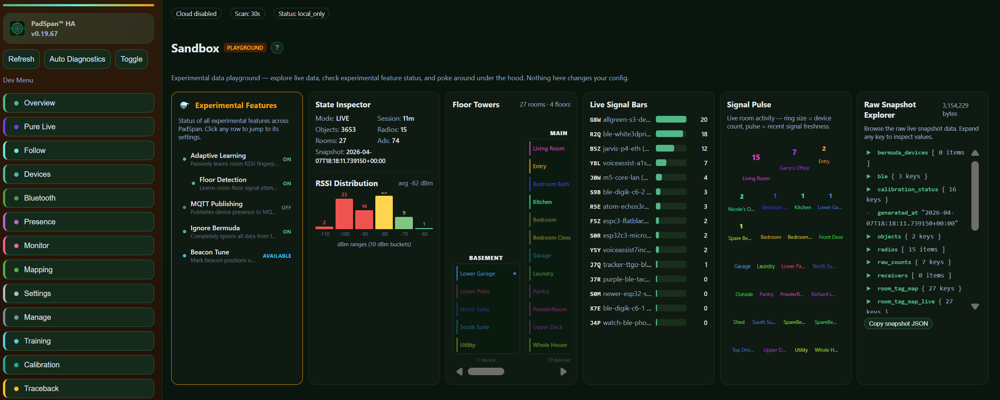

# PadSpan™ HA

### The most comprehensive BLE room-presence system for Home Assistant

PadSpan™ HA goes far beyond "home or away." It tells you **which room** every Bluetooth device is in — updated every 5 seconds — with interactive floor plans, 3D multi-floor visualizations, a full calibration system, and 22 dedicated views. No other Home Assistant BLE integration comes close.

---

## Why PadSpan?

Most BLE presence integrations give you a config flow and a sensor. PadSpan gives you a **complete tracking workstation** — floor plan editor, room boundary polygons, 3D isometric maps, walk-around calibration, follow mode with email alerts, a training hub, and a full sample/demo mode so you can explore every feature before plugging in hardware.

It works with your existing BLE scanners (ESPresense, Bermuda proxies, or any HA Bluetooth proxy). No custom firmware. No cloud dependency. Everything runs locally.

---

## Screenshots

| 3D Multi-Floor Tracking | 3D Heatmap + Signal Overlay |
|:-:|:-:|
|  |  |

| Maps Library | Scanner-to-Device Graph |
|:-:|:-:|
|  |  |

| Traceback Playback + Distance Traveled | Beacon Tune Calibration |
|:-:|:-:|
|  |  |

| Pure Live — Immersive Dashboard | Traceback — Movement Playback |
|:-:|:-:|
|  |  |

| Sandbox Developer Tools | Floor Plan Editor |
|:-:|:-:|
|  |  |

---

## Feature Highlights

### Presence Tracking
- Room-level BLE device tracking (5-second refresh)
- **Follow mode** — animated room map + movement timeline for any tracked device
- Multi-device simultaneous tracking with per-device email alerts (60 s rate limit)
- Kalman-filtered RSSI smoothing (replaces simple moving averages)
- Home/away detection with HA binary sensor entities
- **Phone & watch tracking** — guided setup wizard with [irk-capture](https://github.com/DerekSeaman/irk-capture) integration, HA Companion App iBeacon for Android, and IRK resolution for Apple devices
- Private BLE address resolution (iBeacon UUID + IRK support)
- **Occupancy estimation** — hybrid people counting combining BLE devices, HA person entities, occupancy/motion sensors, and WiFi client counts with a trainable multiplier and RSSI co-location clustering

### Device Identity
- **Stable device identity (padspan_id)** — every physical device gets an immutable ID that survives MAC rotation, iBeacon UUID changes, and firmware updates
- O(1) identity resolution from any volatile key (MAC, iBeacon, canonical_id)
- Automatic migration from older object/tag systems
- Interactive device registry: merge duplicates, add identities, relabel, delete

### Floor Plans & Maps
- Upload architectural floor plans (PNG/JPG) with auto-scaling
- **Two-point measure tool** for precise real-world scale calibration with aspect ratio validation
- Draw room boundary polygons directly over blueprints
- Multi-floor **3D isometric visualization** with live object positions
- **2D flat map mode** with zoom/pan and toggle filters (scanners, tagged, unknown, rooms)
- Drag-and-place scanner markers with 3-digit radio IDs
- Auto-detect stale or missing radios on your map
- Master map alignment for multi-floor coordinate consistency

### Calibration
- Walk-around fingerprint collection with a **standalone phone-friendly panel**
- k-NN fingerprint matching + OLS path-loss model fitting per scanner
- Coverage heatmap with guided "walk here next" target suggestions
- Leave-one-out cross-validation for model quality scoring
- 3D isometric tune view with draggable receiver markers

### Multi-Floor Intelligence
- **Floor-transition learning** — adaptive dwell-based velocity gate prevents phantom floor changes
- Learned cross-floor RSSI attenuation
- Outdoor penalties (0.30× Gaussian damping) for exterior boundary rooms

### Phone & Watch Tracking

Tracking phones is the hardest problem in BLE presence — they rotate their Bluetooth address every ~15 minutes specifically to prevent tracking. PadSpan offers multiple paths depending on your device:

| Device | Easiest Method | What You Need |
|--------|---------------|---------------|
| **Android phone** | HA Companion App iBeacon | Install app, enable BLE Transmitter. Done. |
| **iPhone / iPad** | IRK via [irk-capture](https://github.com/DerekSeaman/irk-capture) | Spare ESP32, flash irk-capture, pair once, paste IRK |
| **Apple Watch** | IRK via irk-capture | Same as iPhone — pair watch to irk-capture ESP32 |
| **AirTag / SmartTag** | Automatic (iBeacon) | Just works — PadSpan groups rotating MACs by UUID |
| **AirPods** | Apple auto-classification | Detected automatically when feature enabled |

The **Phone Setup Wizard** (experimental) guides you through each path with step-by-step instructions. If you have an irk-capture ESP32 on your network, PadSpan auto-detects captured IRKs — no manual hex pasting.

For devices where you can't get an IRK, the experimental **MAC Rotation Bridging** feature matches advertisement patterns across address rotations to maintain tracking continuity.

> **Acknowledgement:** The IRK extraction workflow is built on [Derek Seaman's irk-capture](https://github.com/DerekSeaman/irk-capture) — an ingenious ESP32 tool that emulates BLE peripherals to extract Identity Resolving Keys during pairing. It's what makes practical phone tracking in Home Assistant possible without rooting devices or owning a Mac.

### Scanner Hardware & Management
- **Tested with 20+ ESP32 boards** — the antenna matters more than the chip. Boards with full-size external antennas consistently outperform chip/PCB antennas for room-level accuracy
- Top picks: ESP32-S3 with Ethernet + antenna, ESP32-S3 with WiFi + antenna, ESP32-C3 with antenna
- Auto-discover BLE scanners from Home Assistant integrations
- Per-scanner signal quality metrics and coverage analysis
- WiFi SSID, IP address, and connection type display
- Assign scanners to floors and rooms on the map

### Alerts & Automation
- Email alerts on room change (per device, 60-second rate limit)
- HA entities: **area sensors**, **distance sensors**, **device trackers**, **binary sensors**
- Full WebSocket API for custom dashboards and automation

### UI & Experience
- **Pure Live mode** — immersive full-screen 3D dashboard with pan/zoom, floating glass overlays, and collapsible info panels
- **22 dedicated views** with Basic and Advanced modes
- **5-step onboarding wizard** with auto-detection and progress tracking
- Dark forest-green theme designed for always-on displays
- Built-in **Training Hub** with 14 animated walkthroughs + full manual
- **Sample mode** — fully functional demo with synthetic data, no hardware needed
- **11 languages**: English, Spanish, French, German, Italian, Portuguese, Dutch, Chinese, Japanese, Korean, Russian
- Standalone calibration panel optimized for phone use during walk-around collection
- **NVR-style movement playback** — replay tracked device movement on the 3D map

### Experimental Features (Settings → Features)
- **Phone Setup Wizard** — guided flow for tracking phones and watches. Auto-detects [irk-capture](https://github.com/DerekSeaman/irk-capture) ESP32 devices on your network and walks through IRK extraction step by step. Also shows the easy Android path (HA Companion App iBeacon) and Apple IRK options. Credit to [Derek Seaman](https://github.com/DerekSeaman) for the excellent irk-capture tool that makes IRK extraction practical for everyone.
- **MAC Rotation Bridging** — when a phone's Bluetooth address rotates (every ~15 min), PadSpan matches advertisement characteristics (company ID, services, signal pattern) to tentatively link old and new addresses. Bridges the tracking gap without requiring an IRK. Probabilistic — may occasionally link wrong devices.
- **Apple Device Classification** — automatically labels Apple devices as iPhone, iPad, Apple Watch, AirPods, or AirTag by decoding Bluetooth Continuity protocol messages. Display-only — does not affect tracking or identity.
- **Radio Map** — RSSI heatmap overlay using inverse distance weighting
- **Distortion Map** — k-NN prediction vs reality mismatch visualization
- **Trackability Rating** — per-device Easy/Medium/Hard scoring
- **Walk-to-Identify** — discover unknown devices by correlating walking motion
- **Compass Ring Calibration** — structured 360° RSSI collection
- **Replay Timeline** — enhanced playback with scoring explainability

---

## How It Compares

| Feature | PadSpan HA | Bermuda | Room Assistant | ESPresense |
|:--------|:----------:|:-------:|:--------------:|:----------:|
| Room-level tracking | ✅ | ✅ | ✅ | ✅ |
| Phone tracking wizard | ✅ | — | — | — |
| IRK capture integration | ✅ | — | — | ✅ |
| MAC rotation bridging | ✅ | — | — | — |
| Apple device auto-classify | ✅ | — | — | ✅ |
| Visual floor plans | ✅ | — | — | — |
| 3D multi-floor maps | ✅ | — | — | — |
| 2D flat map + zoom/pan | ✅ | — | — | — |
| Room boundary editor | ✅ | — | — | — |
| Fingerprint calibration | ✅ | — | — | — |
| Hybrid occupancy counting | ✅ | — | — | — |
| Stable device identity | ✅ | — | — | — |
| Training hub (14 walkthroughs) | ✅ | — | — | — |
| Follow mode + email alerts | ✅ | — | — | — |
| Onboarding wizard | ✅ | — | — | — |
| Movement history playback | ✅ | — | — | — |
| Sample/demo mode | ✅ | — | — | — |
| Multi-language (11) | ✅ | — | — | — |
| Dedicated UI views | 22 | Config flow | MQTT config | Web UI |
| HA sensor entities | ✅ | ✅ | ✅ | ✅ |
| Distance estimation | ✅ | ✅ | — | ✅ |
| Kalman RSSI filtering | ✅ | — | — | — |
| Works with ESPHome proxies | ✅ | ✅ | — | ✗ (own firmware) |

---

## Installation

### Via HACS (recommended)

1. Open HACS in your Home Assistant instance
2. Add this repository as a **custom repository** (Integration type)
3. Search for and install **PadSpan HA**
4. **Restart Home Assistant completely** (Settings → System → Restart)
5. Add the integration: Settings → Devices & Services → Add Integration → PadSpan HA

### Manual

1. Download the [latest release](https://github.com/gbroeckling/padspanHA/releases/latest)
2. Extract `custom_components/padspan_ha/` into your HA `custom_components/` directory
3. Restart Home Assistant
4. Add the integration: Settings → Devices & Services → Add Integration → PadSpan HA

---

## Requirements

- Home Assistant **2024.1** or newer
- At least one BLE scanner (ESPresense, Bermuda proxy, or HA Bluetooth proxy)
- HACS (recommended for easy installation and updates)

---

## Quick Start

1. Install via HACS and restart HA
2. Add the PadSpan HA integration
3. Open the **PadSpan HA** panel in the sidebar
4. The **onboarding wizard** guides you through 5 steps: upload a map, set scale, draw rooms, place scanners, calibrate
5. Try **Sample mode** (top-right toggle) to explore every feature with demo data
6. Switch to **Live mode** when ready — your BLE scanners are auto-discovered
7. Tag your devices, upload a floor plan, and start tracking

---

## Documentation

| Guide | Description |
|-------|-------------|
| [Getting Started](docs/GETTING_STARTED.md) | First 30 minutes: install, explore, track |
| [Floor Plan Setup](docs/FLOOR_PLAN_SETUP.md) | Upload, draw rooms, place scanners, set scale |
| [Troubleshooting](docs/90_TROUBLESHOOTING.md) | Common issues and fixes |
| [Architecture](docs/00_REPO_LOGIC_OVERVIEW.md) | High-level codebase architecture |
| [WebSocket API](docs/02_WEBSOCKET_API.md) | API reference for custom integrations |
| [Changelog](CHANGELOG.md) | Full version history |

The **Training Hub** inside PadSpan has 14 animated walkthroughs covering every feature — from BLE basics to Private BLE/IRK setup.

---

## Development

PadSpan HA is built by [Garry Broeckling](https://github.com/gbroeckling) — a 30+ year veteran of coding and scripting who has never claimed to be a fast typist. All architecture, product decisions, testing, and releases are human-directed. Implementation is AI-assisted using [Claude](https://claude.ai) by Anthropic, which accelerates the write–test–ship cycle considerably. Think of it as one developer with strong opinions and a very patient pair-programming partner.

The result: a solo project that ships features at a pace that would normally require a team — without compromising on quality, security, or code review.

---

## Donate

If this project saved you time (or you just like knowing which room your cat is in), you can buy me a coffee:

---

## License

Copyright (C) 2026 Garry Broeckling. Licensed under the [GNU General Public License v3.0](LICENSE).

PadSpan is a trademark of Garry Broeckling.
