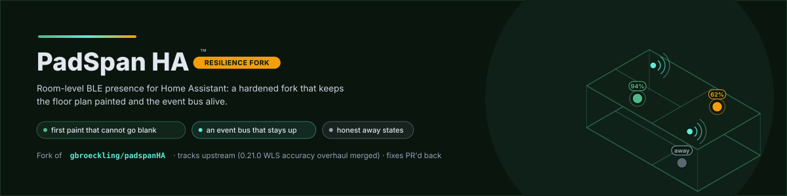

# PadSpan™ HA

BLE room presence for Home Assistant. It tells you which room every Bluetooth device is in, refreshed every 5 seconds, with floor plans, 3D multi-floor views, a calibration system, and 22 panel views.

---

## The Ghosthunter Edition

PadSpan is [Garry Broeckling's](https://github.com/gbroeckling) work, and it is the most ambitious BLE presence project in the Home Assistant world. The Ghosthunter Edition exists because the original is worth building on, and every fix made here goes back to him as a pull request. Thank you, Garry.

A ghost, in BLE presence, is an identity that outlives its device. Phones rotate their Bluetooth address every 15 minutes to resist tracking, so every rotation registers as a new device that appears once and then falls silent forever. Those dead identities pile up in history (this house had 19,641 of them, each still run through the positioning pipeline every poll). A second kind of ghost is stale presence: a device that stops broadcasting used to keep claiming its last room at full confidence, so the map showed people who had left the house. The third is leaked tracking state that stayed in memory for every address ever seen. Ghosthunter removes all three: dead identities expire, silent devices turn grey and honest, leaked state gets purged.

Ghosthunter is [gbroeckling/padspanHA](https://github.com/gbroeckling/padspanHA) plus the reliability work the name promises. It tracks upstream (the 0.21.0 WLS multilateration accuracy overhaul is merged) and fixes the first panel render, event-bus volume, away-device display, and per-poll CPU cost. Untagged history retention is configurable and defaults to one hour. Tagged devices are kept forever.

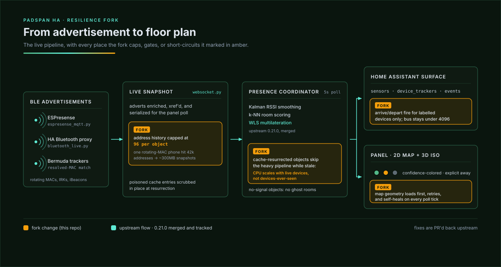

The floor plan used to go blank on first entry. One rotating-MAC phone accumulated 42,000 addresses. Each advertisement carried a copy of that list, which grew snapshots to nearly 300MB. The oversized payload closed the websocket connection and the pending map geometry request failed with it. There was no retry, so the panel stayed blank. Ghosthunter caps address history at 96 per object, fetches and awaits map geometry before the large snapshot, retries a failed geometry fetch without replacing a valid list, and requests missing geometry from the poll loop.

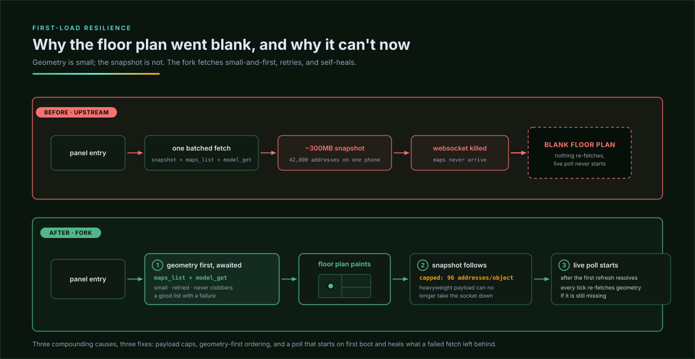

Arrive and depart events fire for labelled devices only. Previously each rotating MAC from each passing phone fired a bus event, and Home Assistant force-disconnected subscribers once 4096 messages were pending. Automation rules inside the panel still match unlabelled devices.

A device that stops advertising shows as "Away (no signal)", a grey dot with an away badge on both maps. Its room confidence is cleared instead of reused. Objects restored from the history cache are marked stale and skip the Kalman and k-NN pipeline until a fresh signal arrives.

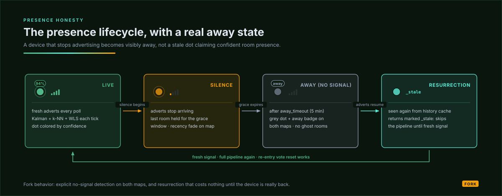

The full fix list is in the [CHANGELOG](CHANGELOG.md). The diagrams are generated by [`docs/diagrams/build.py`](docs/diagrams/build.py).

---

## Why PadSpan?

Most BLE presence integrations give you a config flow and a sensor. PadSpan gives you a floor plan editor, room boundary polygons, 3D isometric maps, walk-around calibration, follow mode with email alerts, a training hub, and a sample mode so you can explore every feature before plugging in hardware.

It works with your existing BLE scanners (ESPresense, Bermuda proxies, or any HA Bluetooth proxy). No custom firmware. No cloud dependency. Everything runs locally.

---

## Screenshots

| 3D multi-floor tracking | 3D heatmap and signal overlay |
|:-:|:-:|
| 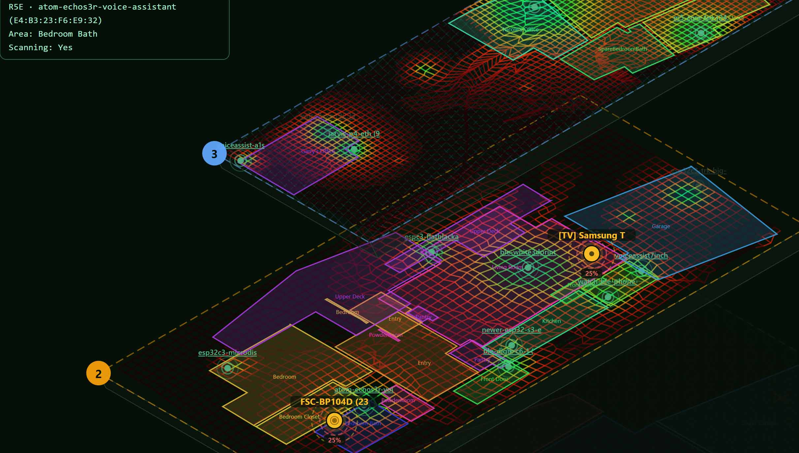 | 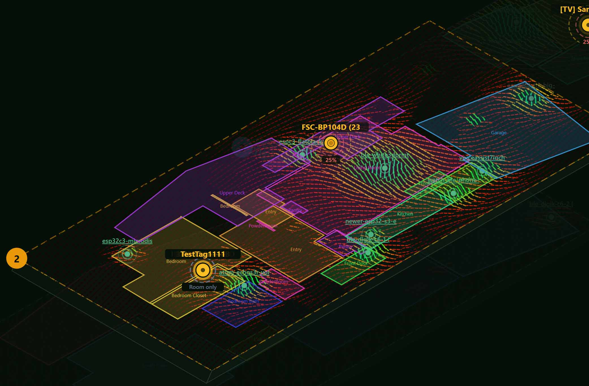 |

| Maps library | Scanner-to-device graph |
|:-:|:-:|
| 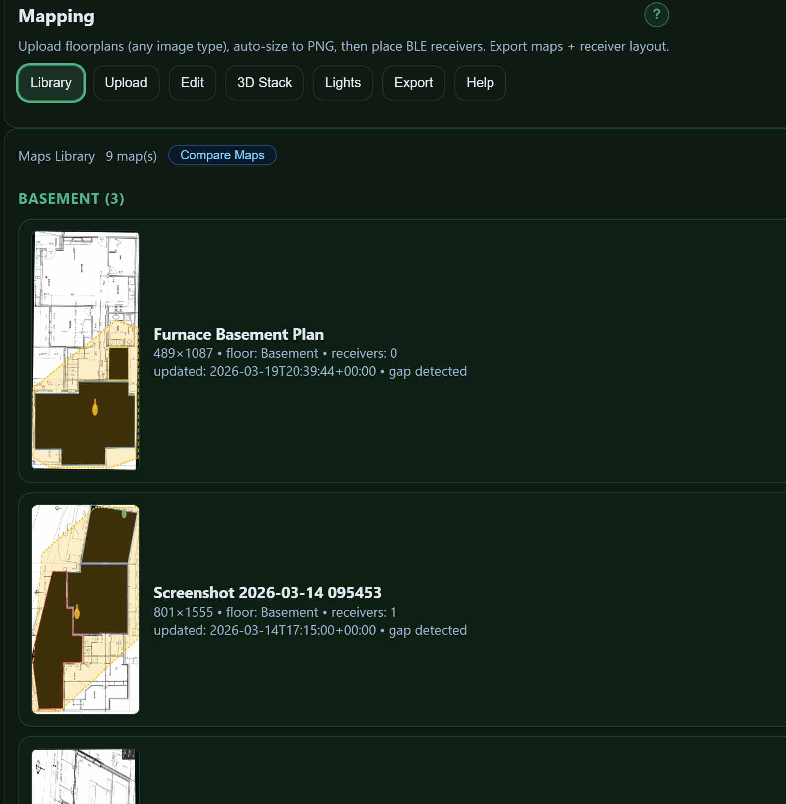 | 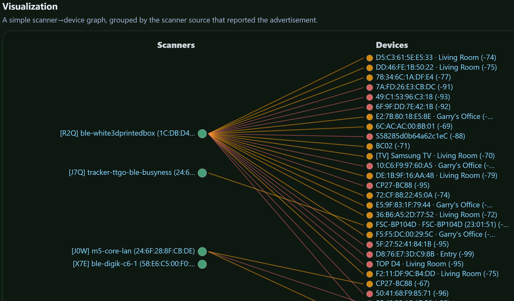 |

| Traceback playback with distance traveled | Beacon tune calibration |
|:-:|:-:|
| 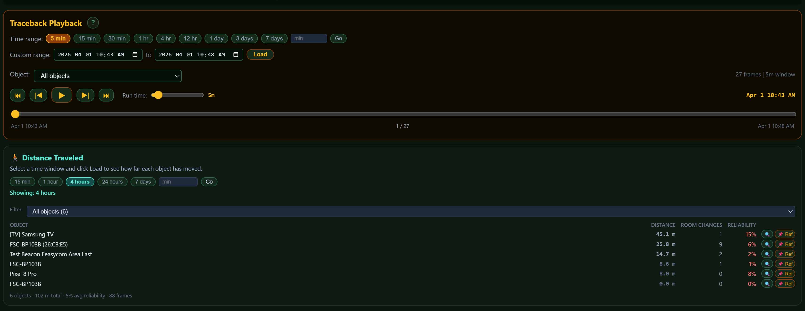 | 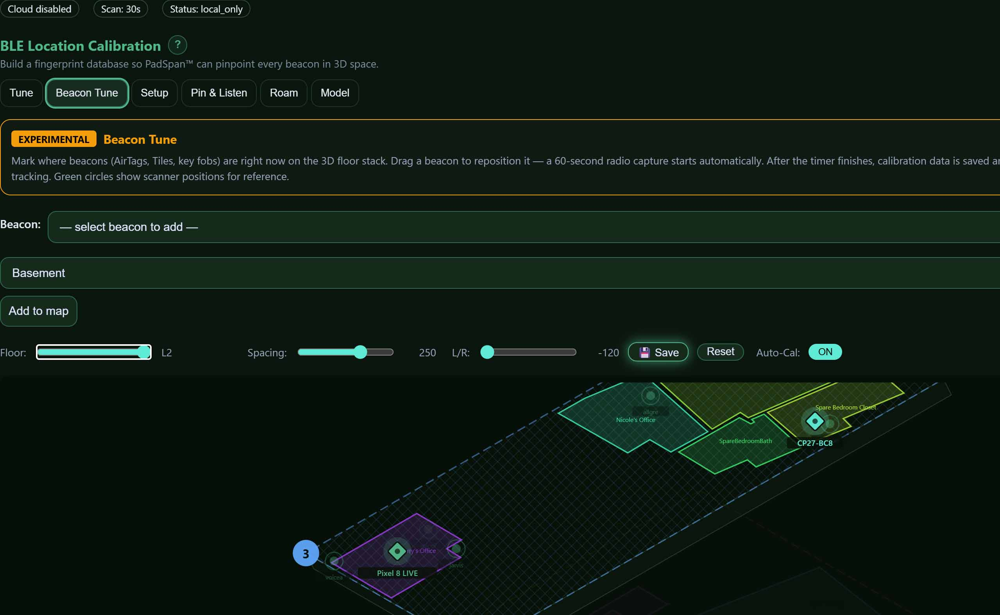 |

| Pure Live immersive dashboard | Traceback movement playback |
|:-:|:-:|
| 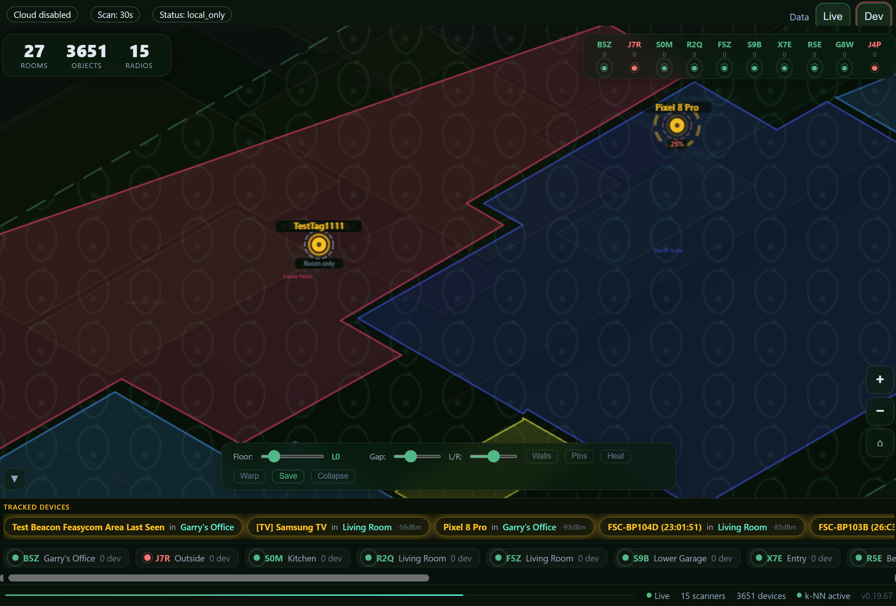 | 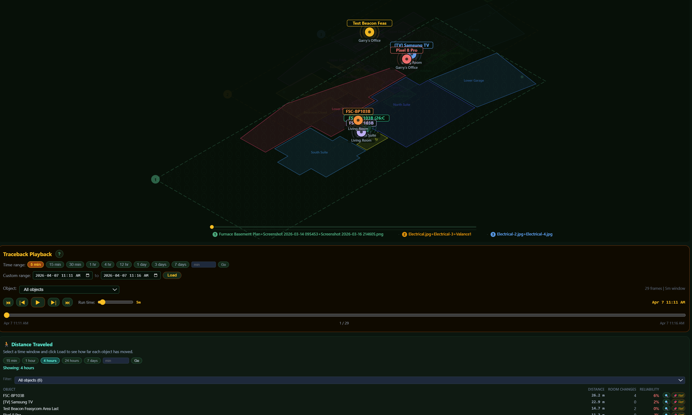 |

| Sandbox developer tools | Floor plan editor |
|:-:|:-:|
| 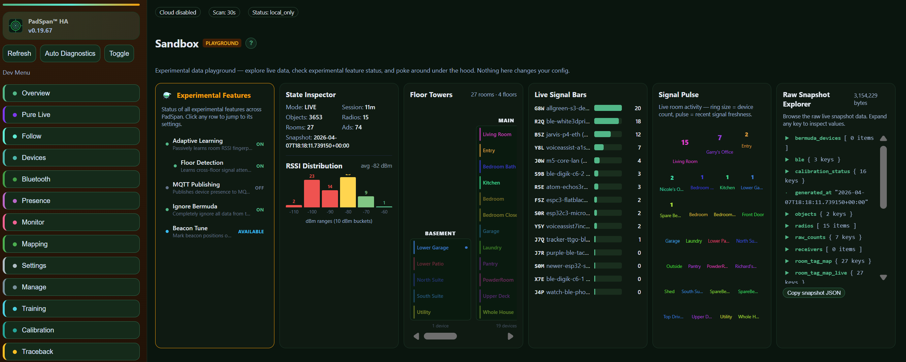 | 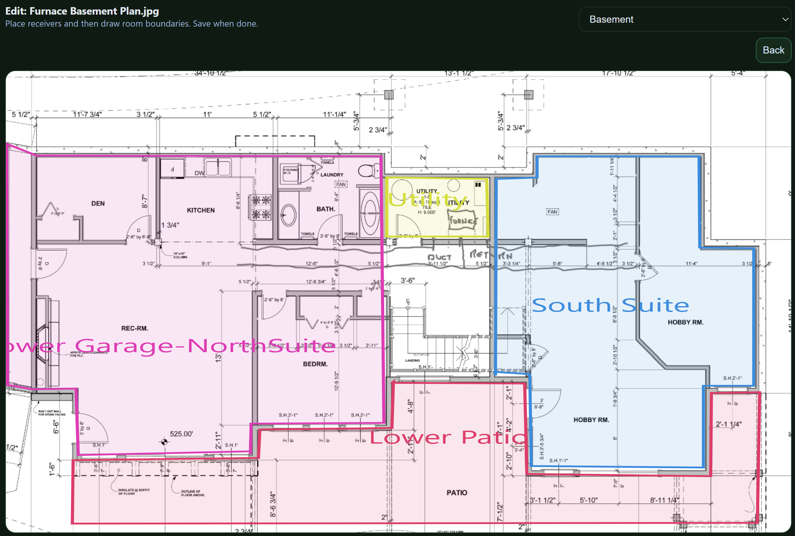 |

---

## Features

### Presence tracking
- Room-level BLE device tracking with a 5-second refresh
- Follow mode: an animated room map and movement timeline for any tracked device
- Multi-device tracking with per-device email alerts (60 second rate limit)
- Kalman-filtered RSSI smoothing instead of simple moving averages
- Home/away detection with HA binary sensor entities
- Phone and watch tracking through a guided setup wizard, with [irk-capture](https://github.com/DerekSeaman/irk-capture) integration, HA Companion App iBeacon for Android, and IRK resolution for Apple devices
- Private BLE address resolution (iBeacon UUID and IRK)
- Occupancy estimation that combines BLE devices, HA person entities, occupancy and motion sensors, and WiFi client counts, with a trainable multiplier and RSSI co-location clustering

### Device identity
- Stable device identity (padspan_id): every physical device gets an immutable ID that survives MAC rotation, iBeacon UUID changes, and firmware updates
- O(1) identity resolution from any volatile key (MAC, iBeacon, canonical_id)
- Automatic migration from older object and tag systems
- Interactive device registry: merge duplicates, add identities, relabel, delete

### Floor plans and maps
- Upload architectural floor plans (PNG/JPG) with auto-scaling
- Two-point measure tool for real-world scale calibration with aspect ratio validation
- Draw room boundary polygons directly over blueprints
- Multi-floor 3D isometric visualization with live object positions
- 2D flat map mode with zoom, pan, and toggle filters (scanners, tagged, unknown, rooms)
- Drag-and-place scanner markers with 3-digit radio IDs
- Auto-detection of stale or missing radios on the map
- Master map alignment for multi-floor coordinate consistency

### Calibration
- Walk-around fingerprint collection with a standalone phone-friendly panel
- k-NN fingerprint matching and OLS path-loss model fitting per scanner
- Coverage heatmap with guided "walk here next" target suggestions
- Leave-one-out cross-validation for model quality scoring
- 3D isometric tune view with draggable receiver markers

### Multi-floor intelligence
- Floor-transition learning: an adaptive dwell-based velocity gate prevents phantom floor changes
- Learned cross-floor RSSI attenuation
- Outdoor penalties (0.30x Gaussian damping) for exterior boundary rooms

### Phone and watch tracking

Phones rotate their Bluetooth address every 15 minutes or so, specifically to prevent tracking. PadSpan offers several paths depending on the device:

| Device | Easiest method | What you need |
|--------|---------------|---------------|
| Android phone | HA Companion App iBeacon | Install the app and enable BLE Transmitter |
| iPhone / iPad | IRK via [irk-capture](https://github.com/DerekSeaman/irk-capture) | A spare ESP32: flash irk-capture, pair once, paste the IRK |
| Apple Watch | IRK via irk-capture | Same as iPhone; pair the watch to the irk-capture ESP32 |
| Tile / Chipolo | Automatic (iBeacon) | Nothing. The UUID is stable, so tag once and the name sticks across rotations |
| AirTag | Probabilistic (experimental) | Enable Apple Device Classification and MAC Rotation Bridging in Settings, Features. AirTags rotate both MAC and Find My key and expose no stable identifier, so bridging links rotations by advertisement pattern. It works while the tag stays in range and can mis-link in crowded RF environments |
| SmartTag (Samsung) | Probabilistic | Same as AirTag: no stable identifier in the air, relies on MAC Rotation Bridging |
| AirPods | Apple auto-classification | Detected and labeled automatically when the feature is enabled. Display only; it does not solve identity |

The Phone Setup Wizard (experimental) walks through each path. If an irk-capture ESP32 is on your network, PadSpan detects captured IRKs so you do not paste hex by hand.

The IRK extraction workflow is built on [Derek Seaman's irk-capture](https://github.com/DerekSeaman/irk-capture), an ESP32 tool that emulates BLE peripherals to extract Identity Resolving Keys during pairing. It makes phone tracking in Home Assistant practical without rooting devices or owning a Mac.

### Scanner hardware and management
- Tested with more than 20 ESP32 boards. The antenna matters more than the chip: boards with full-size external antennas consistently beat chip and PCB antennas for room-level accuracy
- Recommended: ESP32-S3 with Ethernet and an external antenna, ESP32-S3 with WiFi and an antenna, or ESP32-C3 with an antenna
- Auto-discovery of BLE scanners from Home Assistant integrations
- Per-scanner signal quality metrics and coverage analysis
- WiFi SSID, IP address, and connection type display
- Scanner assignment to floors and rooms on the map

### Alerts and automation
- Email alerts on room change (per device, 60 second rate limit)
- HA entities: area sensors, distance sensors, device trackers, binary sensors
- A full WebSocket API for custom dashboards and automation

### UI
- Pure Live mode: a full-screen 3D dashboard with pan, zoom, floating overlays, and collapsible info panels
- 22 views with Basic and Advanced modes
- A 5-step onboarding wizard with auto-detection and progress tracking
- Dark forest-green theme for always-on displays
- A built-in Training Hub with 14 animated walkthroughs and a full manual
- Sample mode: a working demo with synthetic data, no hardware needed
- 11 languages: English, Spanish, French, German, Italian, Portuguese, Dutch, Chinese, Japanese, Korean, Russian
- A standalone calibration panel sized for phone use during walk-around collection
- NVR-style movement playback on the 3D map

### Experimental features (Settings, Features)
- Phone Setup Wizard: guided flow for tracking phones and watches, with irk-capture auto-detection
- MAC Rotation Bridging: when a phone's address rotates, PadSpan matches advertisement characteristics (company ID, services, signal pattern) to tentatively link old and new addresses. Probabilistic; it can occasionally link the wrong devices
- Apple Device Classification: labels Apple devices as iPhone, iPad, Apple Watch, AirPods, or AirTag by decoding Bluetooth Continuity messages. Display only
- Radio Map: RSSI heatmap overlay using inverse distance weighting
- Distortion Map: k-NN prediction versus reality mismatch visualization
- Trackability Rating: per-device Easy/Medium/Hard scoring
- Walk-to-Identify: discover unknown devices by correlating walking motion
- Compass Ring Calibration: structured 360-degree RSSI collection
- Replay Timeline: playback with scoring explainability

---

## How it compares

| Feature | PadSpan HA | Bermuda | Room Assistant | ESPresense |
|:--------|:----------:|:-------:|:--------------:|:----------:|
| Room-level tracking | yes | yes | yes | yes |
| Phone tracking wizard | yes | no | no | no |
| IRK capture integration | yes | no | no | yes |
| MAC rotation bridging | yes | no | no | no |
| Apple device auto-classify | yes | no | no | yes |
| Visual floor plans | yes | no | no | no |
| 3D multi-floor maps | yes | no | no | no |
| 2D flat map with zoom/pan | yes | no | no | no |
| Room boundary editor | yes | no | no | no |
| Fingerprint calibration | yes | no | no | no |
| Hybrid occupancy counting | yes | no | no | no |
| Stable device identity | yes | no | no | no |
| Training hub (14 walkthroughs) | yes | no | no | no |
| Follow mode with email alerts | yes | no | no | no |
| Onboarding wizard | yes | no | no | no |
| Movement history playback | yes | no | no | no |
| Sample/demo mode | yes | no | no | no |
| Multi-language (11) | yes | no | no | no |
| Dedicated UI views | 22 | config flow | MQTT config | web UI |
| HA sensor entities | yes | yes | yes | yes |
| Distance estimation | yes | yes | no | yes |
| Kalman RSSI filtering | yes | no | no | no |
| Works with ESPHome proxies | yes | yes | no | no (own firmware) |

---

## Installation

### Via HACS (recommended)

1. Open HACS in your Home Assistant instance
2. Add this repository as a custom repository (Integration type)
3. Search for and install PadSpan HA
4. Restart Home Assistant completely (Settings, System, Restart)
5. Add the integration: Settings, Devices & Services, Add Integration, PadSpan HA

### Manual

1. Download the [latest release](https://github.com/blurphanatic/padspanHA/releases/latest)
2. Extract `custom_components/padspan_ha/` into your HA `custom_components/` directory
3. Restart Home Assistant
4. Add the integration: Settings, Devices & Services, Add Integration, PadSpan HA

---

## Requirements

- Home Assistant 2024.1 or newer
- At least one BLE scanner (ESPresense, Bermuda proxy, or HA Bluetooth proxy)
- HACS, if you want easy installation and updates

---

## Quick start

1. Install via HACS and restart HA
2. Add the PadSpan HA integration
3. Open the PadSpan HA panel in the sidebar
4. The onboarding wizard covers the 5 setup steps: upload a map, set scale, draw rooms, place scanners, calibrate
5. Try Sample mode (top-right toggle) to explore with demo data
6. Switch to Live mode when ready; your BLE scanners are auto-discovered
7. Tag your devices, upload a floor plan, and start tracking

---

## Documentation

| Guide | Description |
|-------|-------------|
| [Getting Started](docs/GETTING_STARTED.md) | First 30 minutes: install, explore, track |
| [Floor Plan Setup](docs/FLOOR_PLAN_SETUP.md) | Upload, draw rooms, place scanners, set scale |
| [Troubleshooting](docs/90_TROUBLESHOOTING.md) | Common issues and fixes |
| [Architecture](docs/00_REPO_LOGIC_OVERVIEW.md) | High-level codebase architecture |
| [WebSocket API](docs/02_WEBSOCKET_API.md) | API reference for custom integrations |
| [Changelog](CHANGELOG.md) | Full version history |

The Training Hub inside PadSpan has 14 animated walkthroughs, from BLE basics to Private BLE and IRK setup.

---

## Development

Upstream PadSpan HA is built by [Garry Broeckling](https://github.com/gbroeckling). This fork is maintained by Michael Coletta. See [NOTICE](NOTICE.md) for the copyright and trade mark details.

---

## Donate

If the upstream project saved you time, you can buy Garry a coffee:

---

## License

Copyright (C) 2026 Garry Broeckling. Fork modifications Copyright (C) 2026 Michael Coletta. Licensed under the [GNU General Public License v3.0](LICENSE), with the Ghosthunter Edition's cover terms in [The Ghosthunter Licence Note](LICENSE.ghosthunter.md).

PadSpan is claimed as a trade mark by Garry Broeckling; this fork is not endorsed by him. Formal notices, including the Ghosthunter signs, reserved rights and governing law, are in [NOTICE](NOTICE.md).
